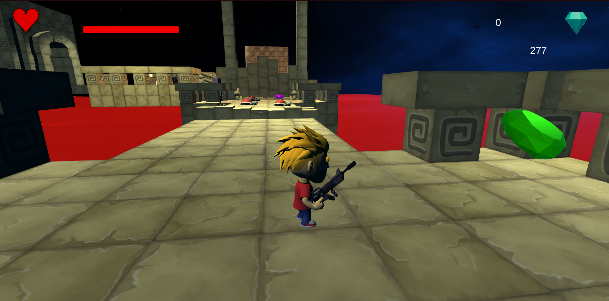
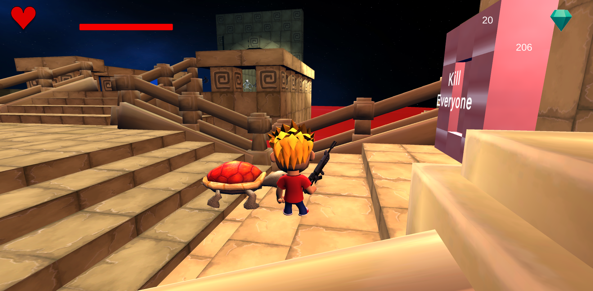

# Gem-Collector

2nd runner up of **"The battle of Coders"** 24-hour game development competition organized by University of Kelaniya.

Intro : This is a simple gem collecting game. Collect as much as gem you can while fighting through enemies.

All external 3d assets used in this project downloaded from Unity Asset Store.

Things need to be improved. 

Preview:

Technologies:
- Unity (C#)
